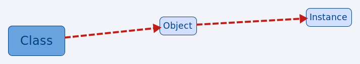

# JavaScript - oo Guide

###一.类、对象、实例
* JavaScript是一种基于原型的语言，它没有声明语句,类是对象的模板
```javascript
  function Person() { }
  // 或
  var Person = function(){ }
  ```
* 对象（类的实例）
```javascript
  function Person() { }
  var zhangsan = new Person();
  var lisi = new Person();
  ```
* 实例是对象的具体表现,如下‘zhangsan’、‘lisi’即为实例
```javascript
  var stu1 = 'zhangsan';
  var stu2 = 'lisi';
```

###二.JS中如何定义Class
* JS中定义Class的方法如下：
```javascript
  function Person(name, age, sex) {
    this.name = name;
    this.age = age;
    this.sex = sex;
 }
// 或
var Person = function() { }
```

###三.JS中如何定义属性、方法（类方法、实例方法）
* 属性就是类中包含的变量，每一个实例都有若干个属性，属性是定义在类的原型中的.
  下面代码中name、age、sex即为Person的属性
```javascript
  function Person(name, age, sex) {
    this.name = name;
    this.age = age;
    this.sex = sex;
  }
```
* 方法与属性很相似， 不同的是：一个是函数，另一个可以被定义为函数。 调用方法很像存取一个属性,
  不同的是add()在方法名后面很可能带着参数. 为定义一个方法, 需要将一个函数赋值给类的prototype
  属性;这个赋值给函数的名称就是用来给对象在外部调用它使用的。以下为类方法和实例的方法的对比
```javascript
  function Person(name, age, sex) {
    this.name = name;
    this.age = age;
    this.sex = sex;
  }
    //类方法
    Person.hellWorld = function() {
      return 'Hello World!';
  }
    //实例方法
    Person.prototype.getName = function() {
      return this.name;
  }
  //调用实例方法
  var person = new Person('Joy', '22', 'Female');
  var name = person.getName();
  console.log(name);
  //调用类方法
  var helloWorld = Person.hellWorld();
  console.log(helloWorld);
```

###四.继承、封装、多态

* 继承是一个或多个类创建类的专用方法（JavaScript只支持简单继承），创建出来的类叫做子类，其他类就
  叫做父类，在JavaScript中父类到子类可以通过指定实例，然后实现他，在现代的浏览器中
  还可以通过创建对象来实现继承。
```javascript
  function Person(name, age, sex) {
    this.name = name;
    this.age = age;
    this.sex = sex;
  }
  function Student(name,age) {
    Person.call(this, name, age, 'male');
  }
  //Student继承Person
  Student.prototype = Object.create(Person.prototype);
  Student.prototype.constructor = Student;
  var student1 = new Student('yanhao',22);
  console.log(student1.name);
  console.log(student1.age);
  console.log(student1.sex);
```
* 封装中我们不需要关心函数内部是怎么实现的，但是仍然可以去使用这个方法，
  如果我们不想改变某些方法我们就不需要去详细地定义子类，这就是封装。
```javascript
  function Person(name, age, sex) {
    this.name = name;
    this.age = age;
    this.sex = sex;
  }
  function Male(name, age) {
    Person.call(this, name, age, 'male');
  }
  var yanhao = new Male('yanhao', 22);
  Male.prototype = Object.create(Person.prototype);
  Male.prototype.constructor = Male;
  function Student(person) {
    this.crew = person;
  }
  Student.prototype.getName = function() {
    return this.crew.name;
  };
  var student1 = new Student(yanhao);
  // console.log(student1.crew.name);//破坏封装，暴露了内部属性
  console.log(student1.getName());
```

* 多态就像原型中定义的方法和属性一样，不同的类可以用相同的名字定义方法；方法局限与他们
  的类中定义，这只能适用于两个类之间没有继承关系。
```javascript
  function Person(name, age, sex) {
    this.name = name;
    this.age = age;
    this.sex = sex;
  }
  function Male(name,age) {
    Person.call(this, name, age, 'male');
  }
  Male.prototype = Object.create(Person.prototype);
  Male.prototype.constructor = Male;
  function Female(name,age) {
    Person.call(this, name, age, 'female');
  }
  Female.prototype = Object.create(Person.prototype);
  Female.prototype.constructor = Female;
  var student1 = new Male('yanhao',22);
  var student2 = new Female('lixue',19);
  var students = [student1, student2];
  for (var i = 0; i < students.length; i++) {
    student = students[i];
    console.log(student.name);
    console.log(student.age);
    console.log(student.sex);
  }
```
